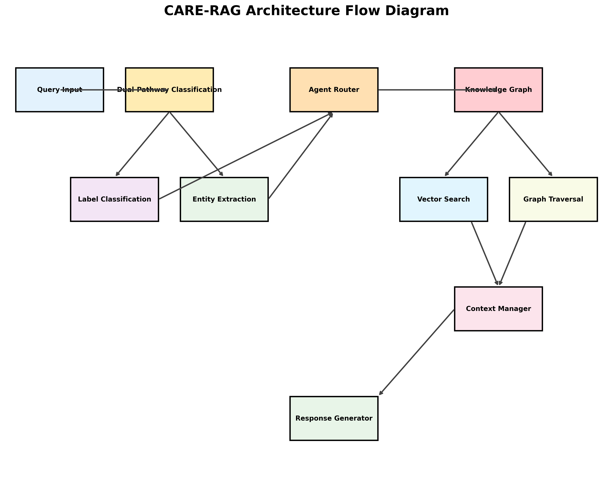

# BioMed-KAI Comprehensive Analysis Results

Complete statistical validation and performance analysis of the BioMed-KAI system, including ablation studies, comparative benchmarks, and interactive visualizations from our research paper.

## Key Findings Summary

    

        

            

                <h3 class="card-title text-primary">85.7%</h3>
                
Diagnostic Accuracy

            

        

    

    

        

            

                <h3 class="card-title text-success">66.5%</h3>
                
Token Efficiency

            

        

    

    

        

            

                <h3 class="card-title text-info">39.3%</h3>
                
CARE-RAG Improvement

            

        

    

    

        

            

                <h3 class="card-title text-warning">p < 0.001</h3>
                
Statistical Significance

            

        

    

## Interactive Analysis Dashboards

    

        

            

                <h5 class="card-title">Performance Dashboard</h5>
                
Comprehensive overview of all system performance metrics, agent comparisons, and CARE-RAG ablation results.

                <a href="interactive/interactive_dashboard.html" class="btn btn-primary">View Dashboard</a>
            

        

    

    

        

            

                <h5 class="card-title">Error Analysis</h5>
                
Interactive exploration of error patterns, recovery rates, and mitigation strategies.

                <a href="interactive/interactive_error_analysis.html" class="btn btn-primary">View Analysis</a>
            

        

    

    

        

            

                <h5 class="card-title">Temperature Analysis</h5>
                
3D visualization of temperature optimization and performance sensitivity.

                <a href="interactive/interactive_temperature_analysis.html" class="btn btn-primary">View Analysis</a>
            

        

    

## Static Visualizations

    

        <h4>System Architecture</h4>
        
        
CARE-RAG system architecture showing dual-pathway classification

    

    

        <h4>Performance Comparison</h4>
        
        
Comparison with state-of-the-art biomedical AI systems

    

## Reproducibility

All analysis scripts and data are available in our [GitHub repository](https://github.com/chemplusx/BioMed-KAI). The interactive visualizations are generated using our comprehensive analysis suite.

[View Analysis Code](https://github.com/chemplusx/BioMed-KAI/tree/master/analysis) | [Download Results](https://github.com/chemplusx/BioMed-KAI/releases)
